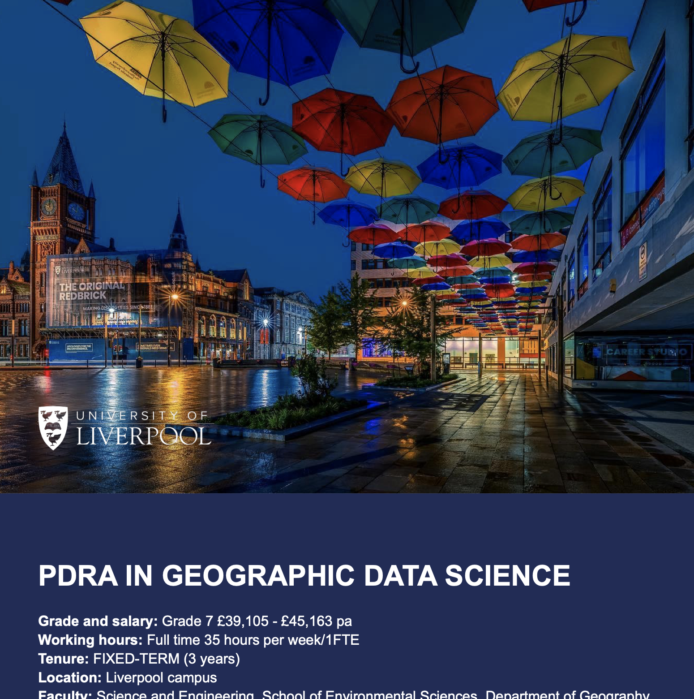

---
authors:
- admin
categories: []
date: "2024-10-16T00:00:00Z"
draft: false
featured: false
image:
  caption: ""
  focal_point: ""
lastMod: "2024-10-16T00:00:00Z"
projects: []
subtitle: 
summary: 
tags: []
title: Postdoctoral Research Associate in Geographic Data Science
---

We are expanding! We are looking for a new Postdoctoral Research Associate in Geographic Data Science to join us at the Geographic Data Science Lab at the University of Liverpool (UoL). This is one of various positions that will follow in the coming months. 

This is a new post at UoL to support delivery of the MRC-funded Mental Health Platform Hub titled: *“Building recovery and resilience in severe mental illness (SMI): Leveraging the role of social determinants in illness trajectories and interventions”*. The aim of this hub is to improve understanding of the role of social determinants, their mechanisms of action on illness trajectories, and how these can be addressed in “social treatments” to support people with SMIs in managing their difficulties and facilitate medium-to-long term recovery. The hub involves a multi-disciplinary team from different institutions, including team including experienced psychologists, clinicians, social scientists, geographers and economists: **Professor Francisco Rowe** (UoL), Professor Jennifer Lau (QML – Chief Co-investigator), Professor Craig Morgan & Dr. Raquel Iniesta (KCL), Professor Domenico Giacco (UOW), Professor Rose Mccabe (CITY), Professor Veena Kumari (Brunel), Dr. Alison Copeland (NU), Professor Richard Byng & Dr. Kerryn Husk (UOP), Tanya Mackay & John Gibson (McPinn) and Emmanuel Gattora (Citizens UK).

The post holder will support the delivery of the project focusing on analysing large and complex geospatial datasets and electronic health records, developing small area statistical indicators, disseminating research findings through preparing research papers and delivering presentations at national and international conferences, and actively engaging with project activities. The post-holder will be to support Prof Francisco Rowe in day-to-day running of the project and will work with the project team.

The post-holder will join the Geographic Data Science Lab in the School of Environmental Sciences at the UoL. They will be expected to contribute to the delivery of high-quality and to the intellectual life of the lab and wider institution, and research at the intersection of geography, data science and mental health. They will have opportunities to make contributions to student education and experience through the delivery of teaching activities in the subject area of geographic data science and undertaking student supervisory roles at the PhD and MSc level. They will also, as agreed with the line manager, contribute to the administration of School/lab and/or university teaching and research activities.

We are keen to appoint people not just based on their past achievements, but also on their future potential and drawing on the widest possible range of talents and backgrounds; applications from under-represented groups are encouraged. We believe that a diverse and supportive environment, bringing different perspectives to our work and allowing people to blossom, is the best platform for excellent research.

Interested? Apply [**HERE**](https://my.corehr.com/pls/ulivrecruit/erq_jobspec_version_4.display_form?p_company=1&p_internal_external=E&p_display_in_irish=N&p_process_type=&p_applicant_no=&p_form_profile_detail=&p_display_apply_ind=Y&p_refresh_search=Y&p_recruitment_id=086286) and more information [HERE](https://my.corehr.com/pls/ulivrecruit/core_document_api_2.view_erecruit_document?p_key_1=7F434C88125DBDEE0F8F7C40376869AC09AC9302E014F7C49DB11C9CA4B30E5EE57080E2E85141EB60DEFB68212BCC0BE85F7285838590B33596D1105AF45A01FDE7C1348DF5191E3C8484847A0D8B19FD3920CD2D23EE36BF5E626F42BC1F0B818A4430B27CBB9A98807FA14A916F7ED3A929EBAA3EA58A447775032C09E43491E683480CB45A835BBE257E0A6D5D966A0734491699A6136A2C3C2D05842928846FBDB099A7385D39BD664FC39206419E2A35D4190DE8947D3C6D9067654CF5&p_key_2=23E955B901C38EE5DB9AFF686645DAF9476983F3EC807CF4007CC839040825335EA113530D2B39A0EACE35D8736B8F7A2E9D941B430E05B7334DBFC8CD89FABE12E24CDB1F9C712499D0E40E5572E19772E1CEB6DB3B14AD67CF22DBAA285BDC06F5B6D6FF96600002960C86C8F66D48E2E529D37EEC84715E7D333DBC53076631E4F0184D9CB5D087AEE1B2E998AE43FED97C1A1F9FE90D16B8A5E350B242438FE2CF7AB7DCB48A3B2D1F2F9CA5BFBE53A91DE29DD4CBE6571CCA8AE9A8D2BD)

For questions about the post, contact me [**Francisco Rowe**](fcorowe@liverpool.ac.uk). 

The post is open for UK-based and international applicants!