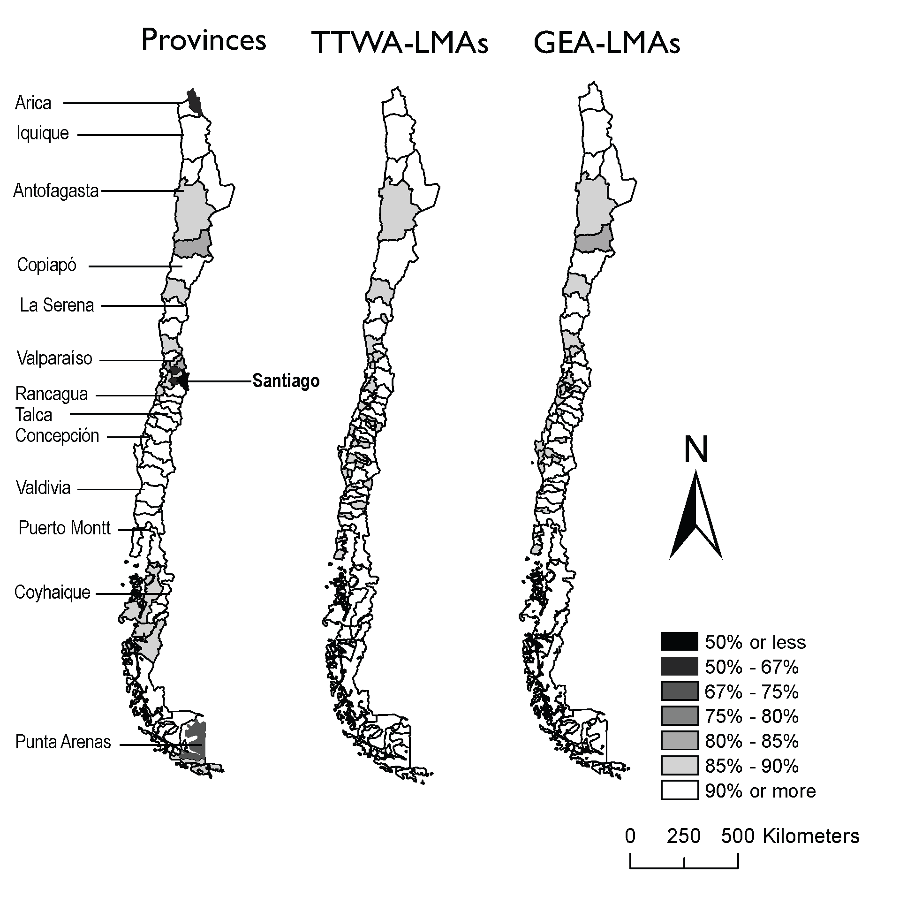

---
authors:
- admin
categories: []
date: "2017-02-23T00:00:00Z"
draft: false
featured: false
image:
  caption: ""
  focal_point: ""
lastMod: "2017-02-23T00:00:00Z"
projects: []
subtitle: Introducing a new method
summary: Introducing a new method
tags: []
title: How do we define functional labour market areas?
---

We all know that spatial analyses based on administrative boundaries to understand labour market activity are questionable, because of the modifiable areal unit problem (MAUP) and measurement issues, leading to spurious causal relationships, misguided policy recommendations and complex model specifications. 

Over the last two decades, there has been a growing literature concerning the delimitation of Functional Labour Market Areas (FLMAs). They are empirically delimited based on commuting (travel-to-work) flow data between Basic Territorial Units (BTUs; eg. communes, municipalities or counties), which are often the finest level of geography at which data are available. The trick here is that there are two conflicting objectives. On the one hand, we want to create FMLAs that are composed of BTUs with strong commuting links i.e. strong cohesion or inner integration. On the other, we want FLMAs comprised of BTUs with weak or no commuting links with other FLMAs i.e. higher self-containment or external perfection. Large FLMAs lead to higher overall levels of self-containment but lower levels of cohesion from a certain threshold. Finding an appropriate balance between self-containment and cohesion is thus critical and challenging task for FMLAs delineation.

We have recently published a paper (Casado-Díaz, Martínez-Bernabéu and Rowe 2017) on a novel methodology based on evolutionary computational algorithms to delineate FLMAs for Chile. Why Chile? Because we wanted to try out this new methodology on a unusual geography and Chile provides just that; and, because I am Chilean! We compared the performance of our approach to the most widely used methodology for official LMA delimitation, the travel-to-work areas (TTWAs) method, in terms of computational efficiency. We also compared the suitability of the resulting FLMAs against administrative areas and TTWAs based on expert local knowledge and misallocation of BTUs. Normally BTUs are allocated to FLMAs with which they have weak links and need to be reassign to a different FLMA.

Applying our algorithm, we proposed a set of 62 FLMAs, which we called “GEA-LMA”: Grouping Evolutionary Algorithm-Labour Market Areas. The figure below presents these areas against provinces (second administrative level of geography in Chile) and TTWA-LMAs. Overall, the proposed areas outperformed administrative areas and TTWA-LMAs, in terms of self-containment and computing efficiency, providing a more appropriate framework for the analysis of spatial labour market activity. In the paper, we suggested two methodological improvements in order to: (1) produce a better conciliation between the different objectives of regionalization; (2) improve the local quality of the final regionalization by reducing the number of misallocated BTUs and the need to make adjustments to achieve a definitive regionalization; and, (3) increase the efficiency of the evolutionary algorithm by reducing the computational time required to find the optimal regionalisation.

Figure 1. Maps of local self-containment: provinces, TTWA-LMAs and GEA-LMAs (labels for regional capital cities are displayed).
Note: Local self-containment of an area is calculated as the minimum value of the share of residents of a BTU working within its considered region, and the share of jobs of that BTU occupied by its residents. 

Our paper is open access and our code is available with the paper if you would like to implement our approach! Get it now from Spatial Economic Analysis on this link!: http://dx.doi.org/10.1080/17421772.2017.1273541

### Reference
José Manuel Casado-Díaz, Lucas Martínez-Bernabéu & Francisco Rowe (2017) An evolutionary approach to the delimitation of labour market areas: an empirical application for Chile, Spatial Economic Analysis, 12:4, 379-403, DOI: http://dx.doi.org/10.1080/17421772.2017.1273541