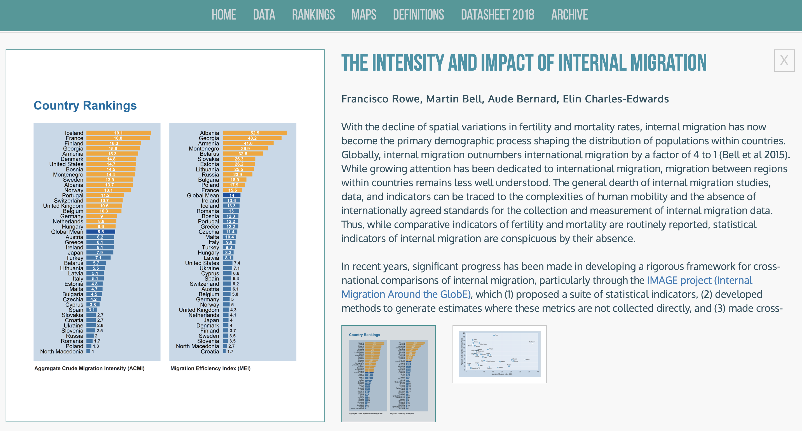

Internal migration is of fundamental importance for individuals and families to achieve their goals and aspirations. At a societal level, internal migration underpins the effective functioning of the labour and housing markets. It is essential to economic resilience by bringing knowledge, skills and labour to locations where needed to enhance economic productivity (Blanchard et al. 1992). This is particular relevant today. Internal migration rates have continuously declined over the last five decades in most countries around the world. This decline is likely to have wide-ranging implications for the functioning of the economy and individuals’ aspirations, but remains poorly recognised and understood. National and local governments have been concerned that the decline in migration heralds a less flexible economy where workers do not move to regions with jobs (Kaplan and Schulhofer-Wohl 2012). Internal migration is the main driver of changing settlement patterns within countries, so understanding declining migration levels is critical to plan for infrastructure delivery and forecast housing needs to ensure appropriate evidence-based policy responses. The project aims to establish the start and pace of the migration decline in 18 European countries, and to determine the factors underpinning this trend by examining associations between the drop in migration rates and broader demographic and socio-economic changes in the last three decades.

**Outputs**

*European Demographic Data Sheet 2020*

As part of this project, we contributed a league table of internal migration intensity and spatial impact for European countries. This league table provides comparative statistics to assess the level and extent of redistribution of population through internal migration within European countries. This is the first time that the [European Demographic Data Sheet](https://www.populationeurope.org/en/) includes a section on internal migration. 

