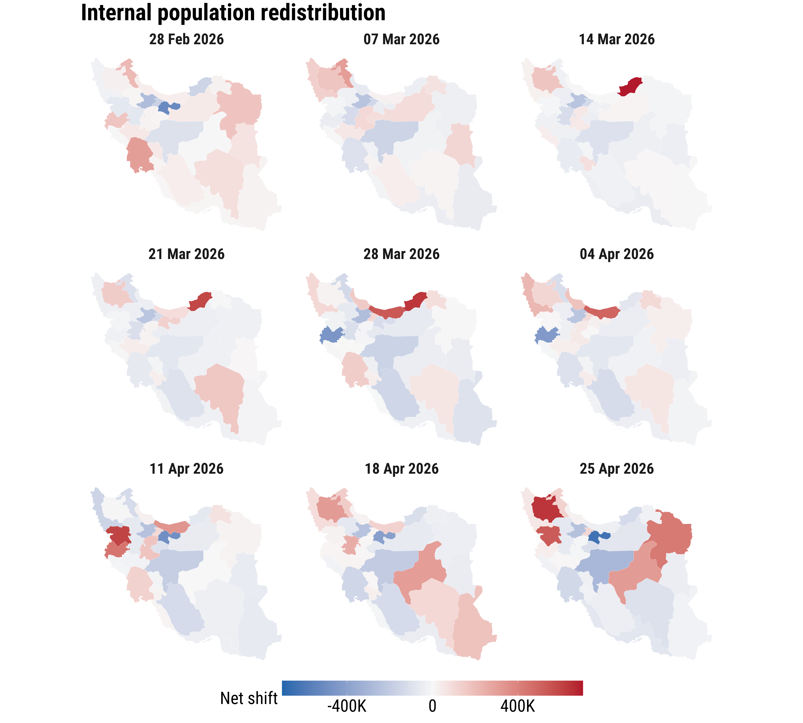
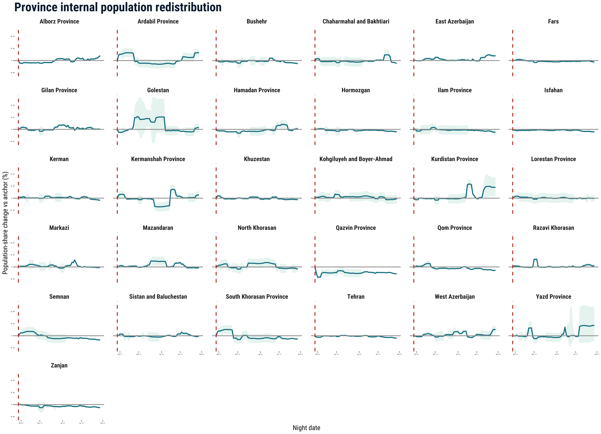
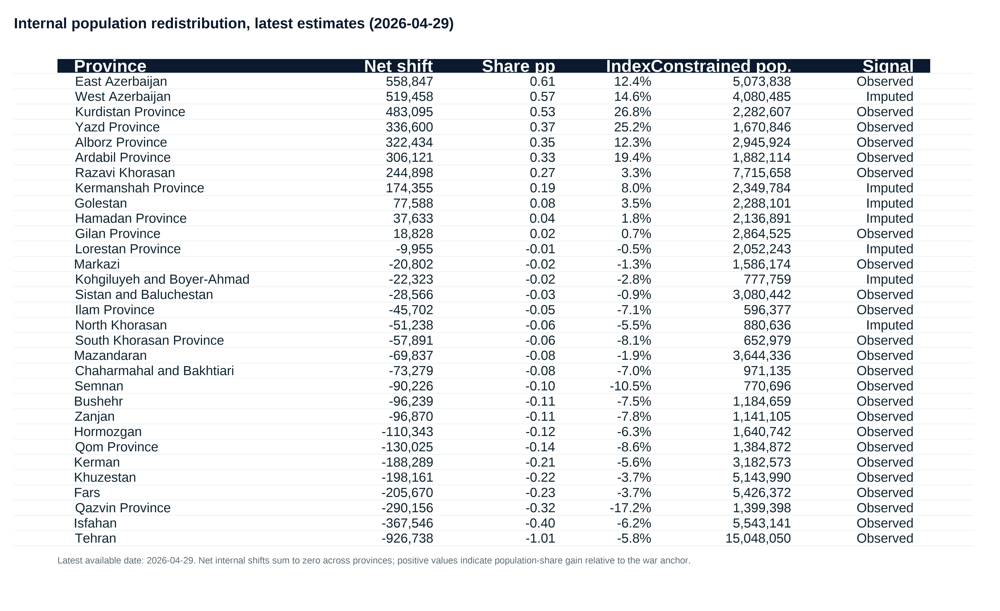

```{r}
story_meta <- read.csv("assets/stories/iran-conflict-population-redistribution/story-metadata.csv", stringsAsFactors = FALSE)
story_reporting_period <- story_meta$reporting_period_label[[1]]

# Derive stat-chip values from the metadata
.war_start  <- as.Date(story_meta$war_start_date[[1]])
.latest     <- as.Date(story_meta$latest_date[[1]])
story_n_days   <- as.integer(.latest - .war_start) + 1
story_provinces <- 31  # Iran ADM1 count; adjust if data scope changes
story_updated  <- format(.latest, "%d %b %Y")
```

::: {.story-shell}

```{=html}
<nav class="story-nav" aria-label="In-page navigation">
  <a class="story-nav-brand" href="#top">
    <span class="story-nav-dot" aria-hidden="true"></span>
    <span>Iran sitrep</span>
  </a>
  <ul class="story-nav-links">
    <li><a href="#what-is-this-story-about"><span class="story-nav-num">01</span> About</a></li>
    <li><a href="#how-should-these-graphics-be-read"><span class="story-nav-num">02</span> How to read</a></li>
    <li><a href="#what-does-the-internal-redistribution-index-show"><span class="story-nav-num">03</span> Redistribution</a></li>
    <li><a href="#what-do-wikipedia-pageviews-add-to-the-story"><span class="story-nav-num">04</span> Wikipedia</a></li>
    <li><a href="#what-should-readers-know-before-interpreting-the-estimates"><span class="story-nav-num">05</span> Caveats</a></li>
    <li><a href="#what-should-readers-take-away"><span class="story-nav-num">06</span> Takeaways</a></li>
  </ul>
  <a class="story-nav-cta" href="resources.html">
    Resources
    <span class="story-nav-cta-arrow" aria-hidden="true">→</span>
  </a>
</nav>
```

::: {.story-topbar}
{fig-alt="Geographic Data Science Lab logo."}
{fig-alt="University of Liverpool logo."}
:::

# Iran conflict and population redistribution

::: {.story-meta}
::: {.story-meta-item}
Authors

Francisco Rowe, Carmen Cabrera, Elisabetta Pietrostefani, Matt Mason, Rodgers Iradukunda, Andrea Nasuto and Emiliano Beltran
:::

::: {.story-meta-item}
Institution

Geographic Data Science Lab, University of Liverpool
:::

::: {.story-meta-item}
Reporting period

`r story_reporting_period`
:::

::: {.story-meta-item}
Source

Web adaptation of the experimental sitrep based on Cloudflare and Wikipedia signals
:::
:::

```{=html}
<ul class="story-stats" aria-label="Headline statistics">
  <li class="story-stat">
    <span class="story-stat-dot" data-tone="slate" aria-hidden="true"></span>
    <span class="story-stat-num">`r story_provinces`</span>
    <span class="story-stat-label">provinces</span>
  </li>
  <li class="story-stat">
    <span class="story-stat-dot" data-tone="ochre" aria-hidden="true"></span>
    <span class="story-stat-num">`r story_n_days`</span>
    <span class="story-stat-label">days analysed</span>
  </li>
  <li class="story-stat">
    <span class="story-stat-dot" data-tone="green" aria-hidden="true"></span>
    <span class="story-stat-num">Updated</span>
    <span class="story-stat-label">`r story_updated`</span>
  </li>
</ul>
```

## What is this story about?

This interactive story updates the situation report methodology and condenses the analysis into a smaller set of visuals. It focuses on the internal redistribution indicators derived from Cloudflare-based estimates of relative population presence, and on Farsi Wikipedia pageviews used as a contextual validation signal.

The aim is modest. These graphics do not estimate exact numbers of displaced people or observe origin-destination flows directly. They show where the strongest relative shifts in population presence appear, how those shifts evolve through time, and whether another digital trace points toward similar geography and timing.

::: {.story-summary}
- Cloudflare HTTPS request data provide the primary proxy for provincial relative presence.
- The reporting estimate constrains provincial shares to a national population control and converts share changes into zero-sum internal redistribution indicators.
- Wikipedia maps and time series serve as contextual validation, not as a second population estimator.
:::

## How should these graphics be read?

Cloudflare publishes aggregated, anonymised counts of encrypted web requests passing through its network. In this workflow, night-time provincial traffic is calibrated against WorldPop 2025 baseline population for December 2025 and then applied after the start of the war on 28 February 2026. The unconstrained relative-presence signal remains a diagnostic measure of Internet-derived presence, while the reporting estimate completes the ADM1-date panel, smooths provincial shares, and applies a national population control informed by external mobility evidence.

The internal redistribution index is the main reporting measure. It captures how much each province's share of the constrained national population estimate has changed relative to the war anchor. Positive values indicate population-share gain relative to other provinces; negative values indicate population-share loss relative to other provinces. Both can still be shaped by Internet connectivity, power cuts, routing disruptions and uneven observability, so persistent patterns and alignment with external signals matter more than any single date.

:::{.cr-section}
## What does the internal redistribution index show?

The redistribution maps ask a narrower question: which provinces gained or lost population share relative to the war-anchor distribution? This is the clearest way to separate internal redistribution from national-level change in the country control. @cr-redist-weekly

The time series show whether those share changes persist, consolidate, or reverse. Sustained positive values are more plausible concentration signals, while sustained negative values are more plausible out-movement or relative-loss signals. @cr-redist-series

The latest table translates the share shifts into people-equivalent net internal redistribution. These values sum to zero nationally each day, so they should be read as a scale indicator for redistribution rather than as observed counts of movers.

:::{#cr-redist-weekly}
{fig-alt="Weekly maps of the ADM1 internal redistribution index."}
:::

:::{#cr-redist-series}
{fig-alt="Province-level internal redistribution index time series with uncertainty bands."}
:::

:::

:::{.story-table-figure}
{fig-alt="Latest table of province-level people-equivalent net internal redistribution estimates."}
:::

:::{.cr-section}
## What do Wikipedia pageviews add to the story?

The Wikipedia material is not asked to do the same job as Cloudflare. Farsi pageviews for border and border-town articles are used to check whether another digital trace points toward similar geography of conflict attention and movement pressure. @cr-wiki-maps

Alignment across sources strengthens confidence in the interpretation. It does not provide a causal estimate or prove movement on its own, but it makes the spatial reading more persuasive than a single-source claim. @cr-wiki-maps

The time series adds a timing check. If pageview attention rises around the same phase in which the redistribution signal shifts most strongly, that supports a shared interpretation of disruption and reorientation. @cr-wiki-series

The limits remain important: counts are small, the signal is partial, and Farsi Wikipedia traffic can include users outside Iran. Its value is contextual and directional. @cr-wiki-series

:::{#cr-wiki-maps}
::: {.story-figure-pair}
{fig-alt="Map of Wikipedia border article signal."}
{fig-alt="Map of Wikipedia border-town article signal."}
:::
:::

:::{#cr-wiki-series}
{fig-alt="Time series of Farsi Wikipedia pageviews relative to baseline."}
:::

:::

## What should readers know before interpreting the estimates?

::: {.story-faq-grid}
::: {.story-faq}
### Internet shutdowns do not make the signal disappear, but they do bias it.

Cloudflare data capture observable HTTPS request activity, not people directly. Blackouts, power cuts and routing disruption can suppress traffic where people remain physically present, while better-connected users, institutions or wealthier urban households may stay more visible.
:::

::: {.story-faq}
### The method reduces this problem without eliminating it.

The analysis uses province shares rather than raw national traffic, focuses on night-time activity, calibrates against a pre-war baseline, applies observability adjustments and gives more weight to patterns that persist and align with independent evidence.
:::

::: {.story-faq}
### The estimates describe relative internet-observable presence.

They are not raw flows, individual movements, unique users or absolute population counts. Positive values may indicate relative in-movement or more stable connectivity; negative values may indicate relative out-movement or local network shocks.
:::

::: {.story-faq}
### Wikipedia is a directional attention signal.

Farsi Wikipedia pageviews help test whether attention to borders and routes changes in ways that are consistent with the Cloudflare-derived geography. They are small, partial and may include users outside Iran, so they are not used to estimate displacement directly.
:::
:::

## What should readers take away?

This revised story keeps the interpretation close to the figures that carry the most weight and separates diagnostics from reporting estimates.

::: {.story-summary}
- The internal redistribution maps, time series and latest table are the core evidence for province-level share shifts.
- The FAQ material clarifies why the estimates should be read as internet-observable, relative and triangulated evidence.
- The results remain proxy evidence and should be read as structured signals, not exact counts or direct flows.
:::

::: {.story-footer}
This webpage was created with [Quarto](https://quarto.org/) and [Closeread](https://closeread.dev/). It is a story-first adaptation of the project sitrep and remains intentionally separate from the PDF report workflow.
:::

:::

```{=html}
<script>
(function () {
  function init() {
    const nav = document.querySelector(".story-nav");
    if (!nav) return;
    const links = Array.from(nav.querySelectorAll(".story-nav-links a"));
    const sections = links
      .map(a => document.getElementById(a.getAttribute("href").slice(1)))
      .filter(Boolean);
    if (!sections.length) return;

    // Smooth scroll for in-page links, with fixed-nav offset
    const navOffset = 88;
    nav.addEventListener("click", (ev) => {
      const a = ev.target.closest("a[href^='#']");
      if (!a) return;
      const id = a.getAttribute("href").slice(1);
      const target = document.getElementById(id);
      if (!target) return;
      ev.preventDefault();
      const top = target.getBoundingClientRect().top + window.scrollY - navOffset;
      window.scrollTo({ top, behavior: "smooth" });
      history.replaceState(null, "", "#" + id);
    });

    // Active-section highlighting
    const byId = new Map(sections.map(s => [s.id, s]));
    const linkById = new Map(links.map(a => [a.getAttribute("href").slice(1), a]));

    const setActive = (id) => {
      links.forEach(a => a.classList.toggle("is-active", a.getAttribute("href") === "#" + id));
    };

    const observer = new IntersectionObserver((entries) => {
      // Pick the entry whose top is closest to the navOffset and visible
      const visible = entries
        .filter(e => e.isIntersecting)
        .sort((a, b) => Math.abs(a.boundingClientRect.top - navOffset) - Math.abs(b.boundingClientRect.top - navOffset));
      if (visible[0]) setActive(visible[0].target.id);
    }, {
      rootMargin: `-${navOffset + 12}px 0px -55% 0px`,
      threshold: [0, 0.2, 0.4, 0.6, 0.8, 1]
    });
    sections.forEach(s => observer.observe(s));

    // Hide nav at the very top (let the masthead breathe)
    const onScroll = () => {
      nav.classList.toggle("is-floating", window.scrollY > 80);
    };
    onScroll();
    window.addEventListener("scroll", onScroll, { passive: true });
  }

  if (document.readyState === "loading") {
    document.addEventListener("DOMContentLoaded", init);
  } else {
    init();
  }
})();
</script>
```
