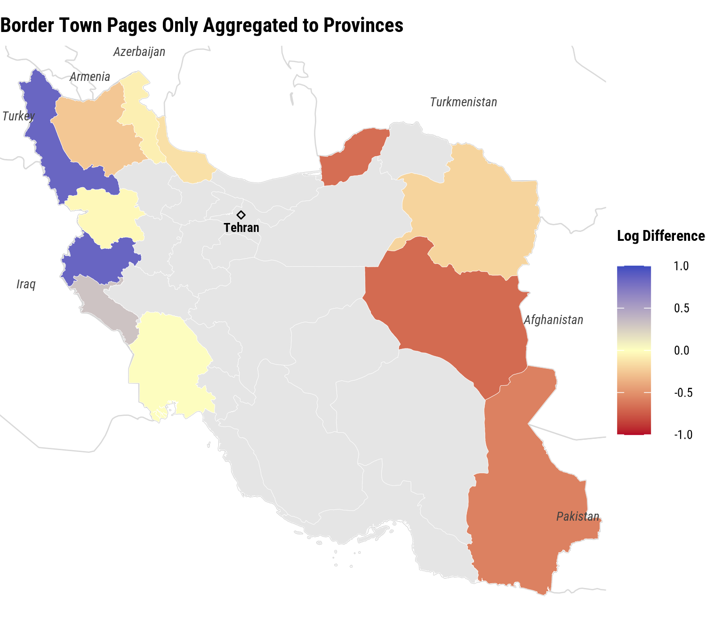
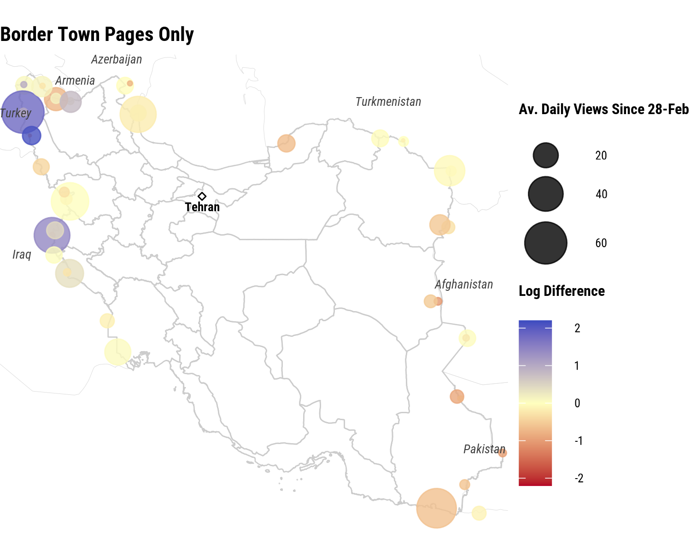
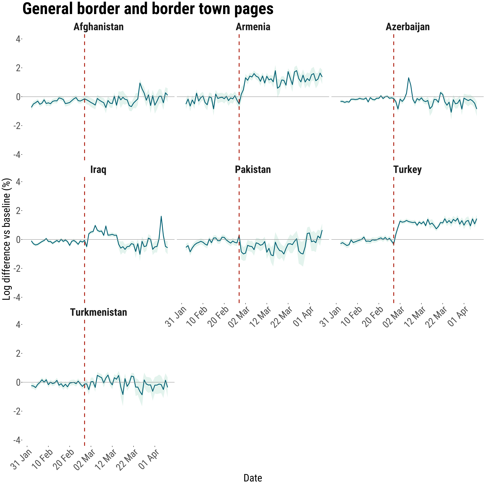

::: {.story-shell}

```{=html}
<div class="story-topbar">
  <a class="story-return" href="resources.html">Back to Resources</a>
  <div class="story-brandmarks">
    
    
  </div>
</div>
```

# Iran conflict and population redistribution

::: {.story-meta}
::: {.story-meta-item}
Authors

Francisco Rowe, Carmen Cabrera, Elisabetta Pietrostefani, Matt Mason, Rodgers Iradukunda, Andrea Nasuto and Emiliano Beltran
:::

::: {.story-meta-item}
Institution

Geographic Data Science Lab, University of Liverpool
:::

::: {.story-meta-item}
Reporting period

28 February 2026 to 19 March 2026
:::

::: {.story-meta-item}
Source

Interactive adaptation of the Iran situation report based on Cloudflare and Wikipedia signals
:::
:::

## What is this story about?

This interactive resource condenses the sitrep into a smaller set of visuals. It focuses on the provincial war-time population index and the Wikipedia pageview evidence used to support or qualify that interpretation.

The aim is modest. These graphics do not estimate exact numbers of displaced people. They help show where the strongest relative shifts in population presence appear, how those shifts evolve through time, and whether another digital trace points toward a similar geography.

::: {.story-summary}
- The war-time population index is the core signal: it shows relative change in provincial presence against a pre-war baseline.
- The province maps and trajectories are the main evidence for geographic redistribution during the reporting period.
- The Wikipedia maps and time series are a contextual check, not a second population estimator.
:::

## How should these graphics be read?

The province index is strongest when it is interpreted as a relative measure. Positive values suggest higher presence than the pre-war baseline, while negative values suggest lower presence, but both can still be shaped by wartime observability and connectivity conditions.

The Wikipedia evidence should be read even more cautiously. Pageview counts are small and partial, but they can still help show whether border-oriented attention and movement pressure are consistent with the geography seen in the province index.

:::{.cr-section}
## What does the war-time population index show?

The first visual question is geographic. Where does the clearest redistribution signal appear once the war begins? In the sitrep, the strongest early changes appear first in border-oriented space rather than evenly across the country. @cr-war-map

That makes the map sequence more than illustration. It is the first substantive claim of the story: the geography of the initial shock is clustered, and that clustering matters for how later changes are interpreted. @cr-war-map

The second question is temporal. The provincial trajectories show whether those shifts persist, consolidate, or reverse as the reporting period continues. @cr-war-series

This is where the story becomes more careful about likely origin and destination areas. Provinces with sustained declines are more plausible candidates for out-movement, while provinces with repeated increases are more plausible concentration zones. @cr-war-series

:::{#cr-war-map}
{fig-alt="Provincial war-time population index maps for key dates in the reporting period."}
:::

:::{#cr-war-series}
{fig-alt="Province-level war-time population index trajectories."}
:::

:::

:::{.cr-section}
## What do Wikipedia pageviews add to the story?

The Wikipedia material is not asked to do the same job as Cloudflare. It is there to show whether another digital trace points toward the same border-oriented geography of conflict attention and movement pressure. @cr-wiki-maps

That matters because alignment across signals strengthens confidence. It does not prove the population interpretation on its own, but it does make the spatial story more persuasive than a single-source reading. @cr-wiki-maps

The time series then adds a timing check. If pageview attention rises sharply around the same phase of the conflict in which the province index shifts most strongly, that supports a common interpretation of disruption and reorientation. @cr-wiki-series

At the same time, the limits remain important: the signal is partial, the counts are small, and the value of the series is contextual rather than definitive. @cr-wiki-series

:::{#cr-wiki-maps}
::: {.story-figure-pair}
{fig-alt="Map of Wikipedia border article signal."}
{fig-alt="Map of Wikipedia border-town article signal."}
:::
:::

:::{#cr-wiki-series}
{fig-alt="Time series of Farsi Wikipedia pageviews relative to baseline."}
:::

:::

## What should readers take away?

This simplified interactive resource keeps the story close to the figures that carry the most interpretive weight.

::: {.story-summary}
- The province maps and trajectories are the core evidence for relative redistribution during the reporting period.
- The Wikipedia maps and time series help assess whether another digital trace supports the same broad geography and timing.
- The results remain proxy evidence and should be read as structured signals rather than exact counts.
:::

::: {.story-footer}
This webpage was created with [Quarto](https://quarto.org/) and [Closeread](https://closeread.dev/). It is a story-first adaptation of the project sitrep, published here as an interactive resource.
:::

:::
