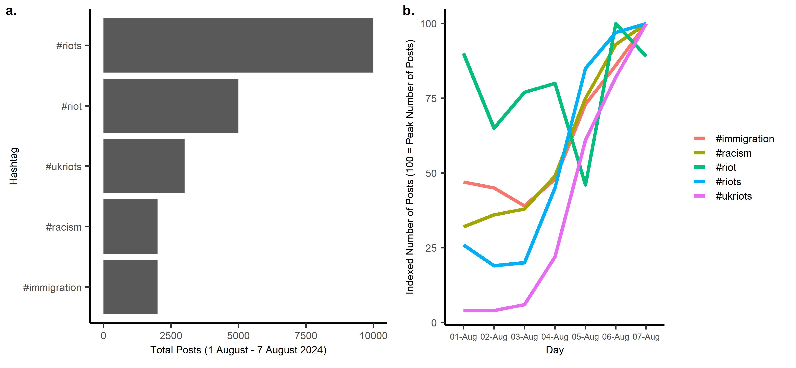

---
authors:
- admin
categories: []
date: "2024-08-26T00:00:00Z"
draft: false
featured: false
image:
  caption: ""
  focal_point: ""
lastMod: "2024-08-26T00:00:00Z"
projects: []
subtitle: 
summary: 
tags: []
title: The role of social media and local deprivation in UK anti-immigration riots
---

Francisco Rowe and Matt Mason

The UK has recently experienced a wave of anti-migrant and Islamophobic riots. Towns and cities across England and Northern Ireland have seen large gatherings of rioters clash with police and hundreds of arrests have been made.

Much of the blame for unrest has been placed on social media. The initial unrest in Southport on 30th July was [driven by disinformation](https://www.nytimes.com/2024/07/31/world/europe/uk-stabbing-southport-riot-police.html) circulated online and far right groups and influencers have [used online platforms](https://www.nytimes.com/2024/08/03/world/europe/uk-stabbing-riots-far-right-protesters-explained.html) to organise and stoke further unrest. The Home Secretary Yvette Cooper has said that social media has ["put rocket boosters"](https://www.ft.com/content/6b886570-1b55-4647-8b6a-c4ad4c5b6925) under posts that encouraged unrest and [other politicians](https://www.bbc.co.uk/news/articles/c785d7j1n17o) have called for new powers to prevent platforms from being used to incite violence.

Obtaining a comprehensive picture of protests and riots is difficult, especially when they are still ongoing. However, digital data from social media can offer a glimpse into the recent events of violence following the tragedy of Southport. A few years back just before the COVID-19 pandemic hit, I started using social media data to analyse anti-migration sentiment and that research led to collaborative work with the United Nations International Organization for Migration (IOM) which resulted in [a paper](https://doi.org/10.1017/dap.2021.38) published in Data & Policy, [a book chapter](https://publications.iom.int/books/harnessing-data-innovation-migration-policy-handbook-practitioners) for an IOM handbook for practitioners, [a policy brief](https://publications.iom.int/books/sentiment-towards-migration-during-covid-19-what-twitter-data-can-tell-us) and various outcomes thereafter. At the Geographic Data Science Lab (GDSL) of the University of Liverpool, I have led a group aiming to investigate the spread of anti-immigration sentiment on social media platforms. Matt Mason, PhD student , has been leading a project investigating how online anti-immigration activity spills onto the streets of the UK and decided to look at the recent UK riots triggered by the trafic events in Southport.

Drawing on social media data, we observed a large increase in activity related to riots and migration in relation to the recent riots in the UK. In the first week of August, #riots and #riot were the two most popular hashtags used on UK TikTok, with 10,000 and 5,000 posts, respectively. Of the top five most popular hashtags used posts from the UK, all were related to the riots, migration or racism (Figure 1a) and they all have recorded a rapid increase in the number of posts (Figure 1b). We have seen that online posts with disinformation about the identity of the Southport attacker have been [seen tens of millions of times](https://x.com/marcowenjones/status/1818343648821407971). The [reported number](https://www.ft.com/content/b76628d7-5acd-439c-849a-f386e2eb5236) of British users on Telegram soared in the wake of the initial riots in Southport. Telegram has become a popular social media platform among far right activists given its relatively lax approach to content moderation. The use of the platform by these groups in the UK has [grown in recent years](https://link.springer.com/content/pdf/10.1007/s41109-022-00513-8.pdf) and an ecosystem of groups and channels has developed.

 *Figure 1. a. Total posts by top five most used hashtags on UK TikTok posts between 1 August - 7 August 2024; b. Indexed number of posts by top five most used hashtags on UK TikTok posts between 1 August - 7 August 2024 (100 = peak number of posts).*

Online platforms can be used to spread misinformation and organise unrest, but they are not their sole cause. Traditional media plays an important role in framing the public debate around migration, and in Britain press coverage on this issue is largely negative. Indeed, a 2016 UN report found right-wing press coverage in Britain ["expressed a hostility towards refugees and migrants which was unique"](https://www.unhcr.org/uk/media/press-coverage-refugee-and-migrant-crisis-eu-content-analysis-five-european-countries). Moreover, many politicians (including government ministers) in the UK have ramped up their rhetoric against migrants and refugees in recent years, [invoking terms](https://www.kcl.ac.uk/suella-bravermans-talk-of-a-refugee-invasion-is-a-dangerous-political-gambit-gone-wrong) designed to increase fear and anxiety around migration.

But local factors also play a role. What is telling about the recent spate of unrest is where it has taken place. Anti-immigration sentiment in the UK seems to be linked to long-term social stagnation and economic decline. The majority of anti-migrant events have been seen in towns and cities in areas of England with high levels of deprivation (Figure 2). As well as having higher levels of socio-economic deprivation, these areas have experienced significantly [larger cuts](https://ifs.org.uk/publications/how-have-english-councils-funding-and-spending-changed-2010-2024) to budgets for local services since 2010. The COVID-19 pandemic and ongoing cost of living crisis has [increased levels of material deprivation and food insecurity in the UK](https://ifs.org.uk/news/new-statistics-show-large-increases-material-deprivation-and-food-insecurity-during-cost), hitting already deprived areas the hardest. [Academics](https://books.google.co.uk/books?hl=en&lr=&id=LnUoAgAAQBAJ&oi=fnd&pg=PA148&ots=A_L1mG2qGi&sig=Nd6KGpxk27hjoLSwfi-lPbeOVTE&redir_esc=y#v=onepage&q&f=false) have long theorised that economic factors can drive anti-migrant sentiments. They suggest that in times of economic malaise migrants and minority groups can come to be perceived as a threat by seemingly increasing the competition in the labour market and for resources.

 *Figure 2: Riot locations and average local authority index of multiple deprivation (IMD) score (high number = high level of deprivation)*

Given this, areas of high deprivation can become key targets for far right organisers to spread their anti-migrant and Islamophobic messages. [Researchers have demonstrated](https://www.hbs.edu/ris/Publication%20Files/24-024_da5e436e-b4e8-4215-b788-f6043dbc7d1f.pdf) that in areas of Italy where access to local services have declined, far right parties achieve better results in elections and that these parties increasingly link levels of public services to immigration. Furthermore, in the context of England, [researchers have shown](https://theloop.ecpr.eu/community-deprivation-drives-far-right-violence/) that local community deprivation can be a predictor of where far right violence occurs.

In recent years, far right groups have focused their attention on hotels providing shelter for refugees. Previous government policy [to disproportionately house asylum seekers in poorer areas](https://www.independent.co.uk/news/uk/home-news/asylum-seekers-housing-refugees-councils-uk-home-office-a9193876.html), where accommodation was cheaper, has allowed far right groups to explicitly link issues around local service cuts and economic hardship with migration. Indeed, areas that have housed higher numbers of asylum seekers are ["often communities that are already socio-economically deprived, and have high unemployment, which can contribute to a sense that there is competition for scant resources"](https://www.independent.co.uk/news/uk/home-news/far-right-riots-uk-economy-poverty-b2592550.html). Protests organised by far right groups outside these hotels have become increasingly common in recent years. The most notable of these was in early 2023 [in Knowsley](https://www.bbc.co.uk/news/uk-england-merseyside-66236255) (one of the most deprived areas of England), during which a protest broke out into a riot and a police van was set ablaze. In 2022 [there were 253 protests](https://www.theguardian.com/uk-news/2023/mar/05/uk-government-complicit-asylum-seeker-hotel-attacks-say-unions) outside hotels, twice the number recorded in 2021.

The events of the past two weeks have shown the damaging effect that misinformation on social media can have and the need for platforms to do more to combat extremists on their sites. However, we must not lose sight of the role of local factors. Deprivation is not the sole reason for the geographical patterns of anti-migrant violence, and the vast majority of Britons entirely reject the riots and rioters, regardless of where they live. Indeed, in [a recent study](https://doi.org/10.48550/arXiv.2401.06658) to be published on PLOS ONE, I and Andrea Nasuto showed that there is a small online anti-migration community but it disproportionately contributes to generate and spread anti-immigration content. The recent riots have been [almost exclusively confined to England](https://theconversation.com/the-trouble-with-england-why-rioting-in-the-uk-has-not-spread-to-scotland-and-wales-236423), suggesting that something specific about the discourse and debate surrounding migration in England is a significant factor. This said, when dealing with the aftermath of recent unrest, we must engage with the local factors that have provided an opening for far right groups to mobilise dissatisfaction and discontent to stoke anti-migrant sentiment and violence.
