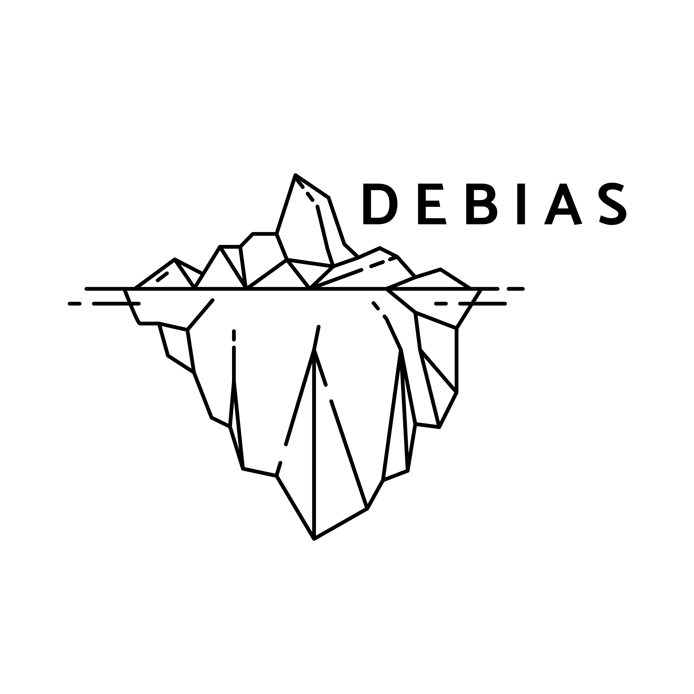

::: {.media-grid}

::: {.media-card .resource-card}

::: {.resource-visual .resource-story-visual .is-breathing-map aria-hidden="true"}
{fig-alt=""}
interactive story
:::

### Iran Conflict and Population Redistribution

Scroll-based narrative on conflict, mobility, and proxy population signals from the Iran sitrep.

[Open story](iran-conflict-population-redistribution.html)
:::

::: {.media-card .resource-card}

institution finance

<strong>155</strong>institutions
<strong>4</strong>growth bands
<strong>12</strong>metrics

<svg viewBox="0 0 120 52" preserveAspectRatio="none" aria-hidden="true">
<polyline points="6,35 28,27 50,31 72,19 94,23 114,12"></polyline>
<circle cx="114" cy="12" r="3.4"></circle>
</svg>

### UK University Sustainable Growth

Interactive dashboard ranking 155 UK institutions by sustainable-growth financial performance.

[Open dashboard](assets/resources/sustainable-growth-dashboard.html)
:::

::: {.media-card .resource-card}

::: {.resource-visual .resource-debias-visual aria-hidden="true" style="--panel-bg-a: #071916; --panel-bg-b: #0f2a33; --panel-glow-a: rgba(34, 197, 94, 0.24); --panel-glow-b: rgba(20, 184, 166, 0.20); --panel-glow-c: rgba(250, 204, 21, 0.13);"}
{fig-alt=""}
DEBIAS package
:::

### debiasR

R package for assessing and correcting representation bias in digital trace counts and origin-destination flows.

[Open package site](https://de-bias.github.io/debiasR/)
:::

::: {.media-card .resource-card}

  count distribution

### Count Data Modelling

Methods, examples and code for modelling count outcomes.

[Open website](https://fcorowe.github.io/countdata_modelling/)
:::

::: {.media-card .resource-card}

  probability curve

### Binary Logistic Regression

Methods, examples and code for binary outcome modelling.

[Open website](https://fcorowe.github.io/binary_logistic/)
:::

::: {.media-card .resource-card}

  migration composition

### R Package CIM

Code and resources for compositional impact of migration analysis in R.

[Open website](post/2019-01-31-r-rmarkdown/index.html)
:::

::: {.media-card .resource-card}

  tiled map

### Census Mapping

Interactive resources and examples for census-based spatial mapping.

[Open website](https://fcorowe.github.io/census-mapping/)
:::

:::

